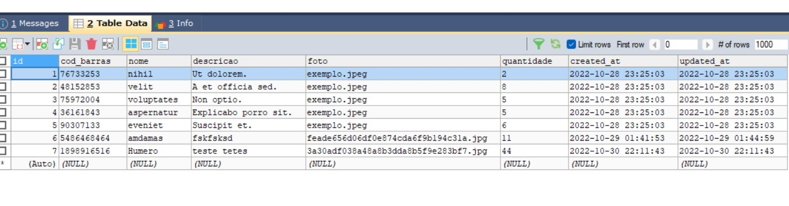
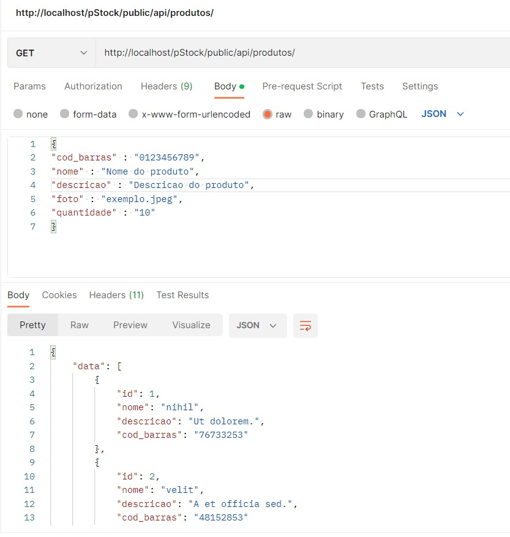

Projeto de gerenciamento de estoque feito em PHP 8.1, Laravel 9, Blade, Bootstrap 5 e banco de dados MySql.
Nota: Correção da estrutura para melhor visualizaçao das rotas e métodos utilizados.

Collection:
Listar todos produtos: GET -> http://localhost/pStock/public/api/produtos/

Ver um produto específico: GET -> http://localhost/pStock/public/api/produtos/produto/{id_do_produto}

Novo produto: POST -> http://localhost/pStock/public/api/produtos/cadastrar
Headers: Key = 'Content-Type' Value = 'application/json'. 
Body: {
"cod_barras" : "0123456789",
"nome" : "Nome do produto",
"descricao" : "Descricao do produto",
"foto" : "exemplo.jpeg",
"quantidade" : "10"
}

Editar produto: PUT -> http://localhost/pStock/public/api/produtos/produto/{id_do_produto}/editar
Headers: Key = 'Content-Type' Value = 'application/json'. 
Body: {
"cod_barras" : "0123456789",
"nome" : "Nome do produto",
"descricao" : "Descricao do produto",
"foto" : "exemplo.jpeg",
"quantidade" : "10"
}

Deletar produto: DELETE -> http://localhost/pStock/public/api/produtos/produto/{id_do_produto}/deletar

