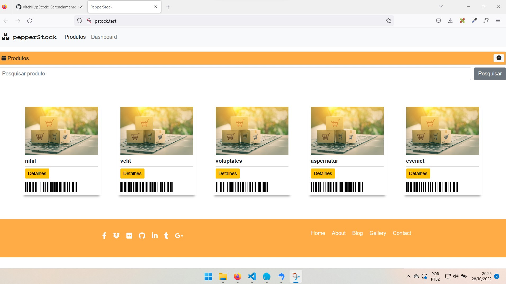
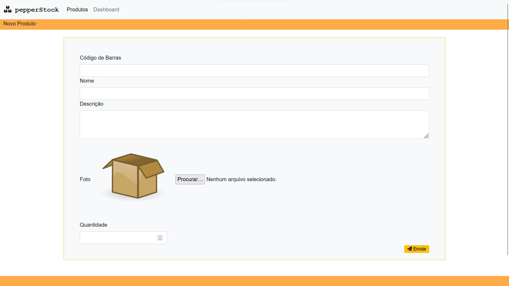
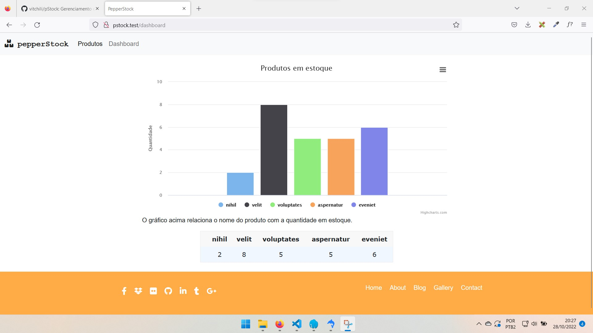

Projeto de gerenciamento de estoque feito em PHP 8.1, Laravel 9, Livewire/Blade, Bootstrap 5 e banco de dados MySql.
Nota: a distribuição de arquivos de Controller no path da Livewire foi não foi aplicada da forma como eu utilizaria profissionalmente. A princípio eu iria fazer toda comunicação front-back pelo Livewire, mas isso impossibilitaria de o gestor ver a utilização das rotas e métodos corretos para análise do teste. Portanto, os Controllers estão separados no path Livewire momentaneamente, para fins de avaliação de comunicação.

